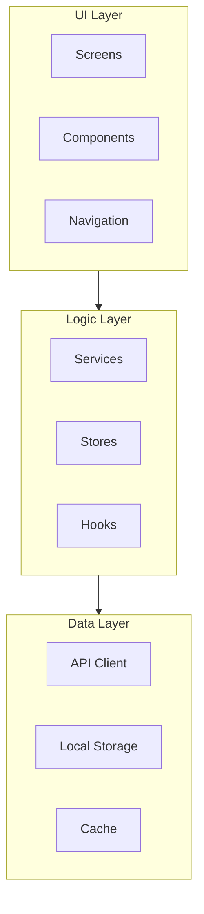
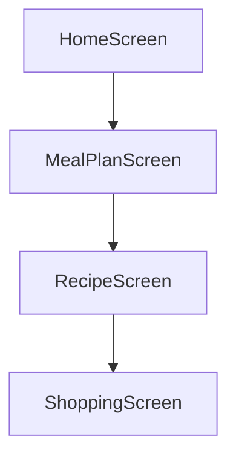
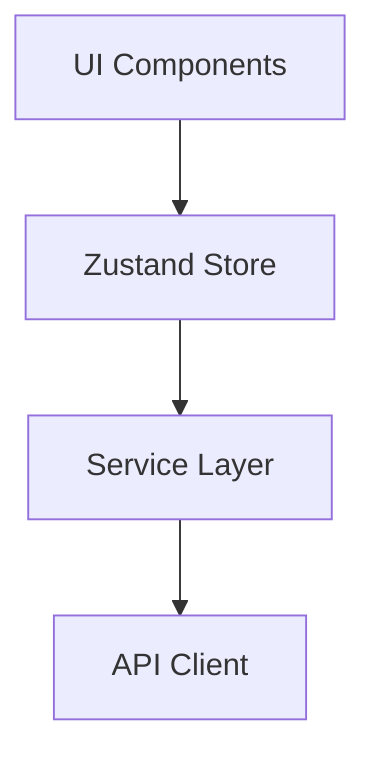
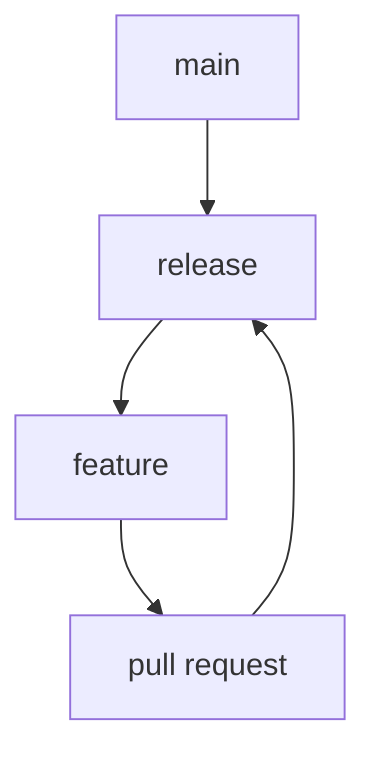

# System Patterns

## Architecture Overview

### Component Architecture


## Design Patterns

### 1. Component Patterns
- **Atomic Design**
  - Atoms (basic UI elements)
  - Molecules (composite components)
  - Organisms (complex components)
  - Templates (page layouts)
  - Pages (screen components)

- **Component Structure**
  ```typescript
  // Component Template
  export interface ComponentProps {
    // Props interface
  }

  export const Component: React.FC<ComponentProps> = ({
    // Props destructuring
  }) => {
    // State and hooks
    // Business logic
    return (
      // JSX
    );
  };
  ```

### 2. State Management
- **Zustand Store Pattern**
  ```typescript
  // Store Template
  interface StoreState {
    // State interface
  }

  interface StoreActions {
    // Actions interface
  }

  const useStore = create<StoreState & StoreActions>((set) => ({
    // State and actions implementation
  }));
  ```

### 3. Service Layer
- **Repository Pattern**
  ```typescript
  // Service Template
  export interface ServiceInterface {
    // Method signatures
  }

  export class Service implements ServiceInterface {
    // Method implementations
  }
  ```

## Component Relationships

### 1. Screen Flow


### 2. Data Flow


## Implementation Patterns

### 1. Navigation
- Stack-based navigation
- Tab-based navigation
- Modal presentations
- Screen transitions

### 2. Form Handling
- Controlled inputs
- Form validation
- Error handling
- Submit handling

### 3. Data Fetching
- API client abstraction
- Error boundaries
- Loading states
- Cache management

## Code Organization

### 1. Directory Structure
```
src/
├── components/
│   ├── atoms/
│   ├── molecules/
│   └── organisms/
├── screens/
├── navigation/
├── services/
├── stores/
├── hooks/
├── utils/
└── types/
```

### 2. File Naming
- Components: PascalCase.tsx
- Utilities: camelCase.ts
- Types: *.types.ts
- Tests: *.test.ts

## Testing Patterns

### 1. Unit Tests
- Component testing
- Hook testing
- Utility testing
- Store testing

### 2. Integration Tests
- Screen flows
- API integration
- Navigation flows
- Form submissions

## Error Handling

### 1. Error Boundaries
```typescript
class ErrorBoundary extends React.Component {
  // Error catching and fallback UI
}
```

### 2. API Errors
```typescript
try {
  // API call
} catch (error) {
  // Error handling
}
```

## Performance Patterns

### 1. Optimization
- Memoization
- Lazy loading
- Code splitting
- Virtual lists

### 2. Caching
- API response caching
- Image caching
- State persistence
- Offline support

## Security Patterns

### 1. Data Protection
- Input sanitization
- API key management
- Secure storage
- Data encryption

### 2. Authentication
- Token management
- Session handling
- Access control
- Secure routes

## Accessibility Patterns

### 1. UI Components
- ARIA labels
- Focus management
- Color contrast
- Screen reader support

### 2. Navigation
- Keyboard navigation
- Skip links
- Focus trapping
- Touch targets

## Development Workflow

### 1. Git Flow


### 2. Code Review
- Pull request template
- Review checklist
- Style guide
- Documentation requirements

## Documentation

### 1. Code Documentation
- JSDoc comments
- Type definitions
- README files
- API documentation

### 2. Architecture Documentation
- Component diagrams
- Data flow diagrams
- API specifications
- State management 