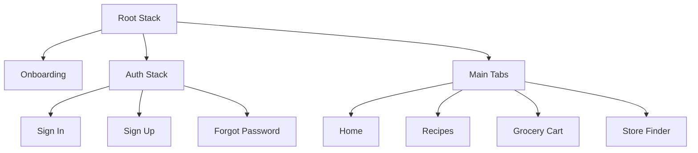
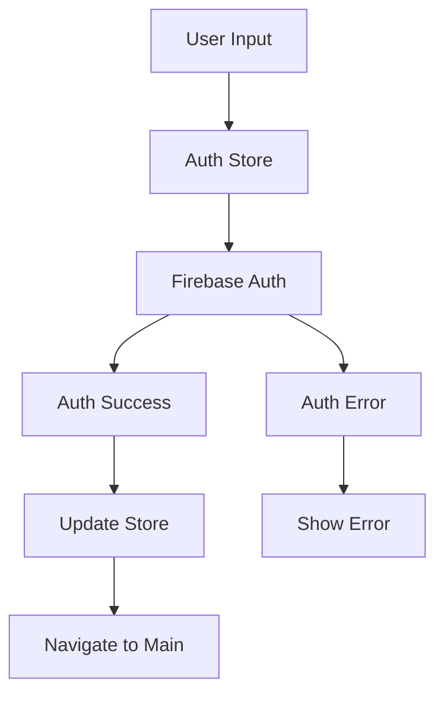
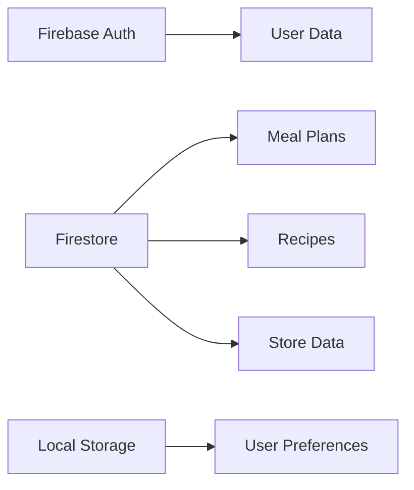

# FlavrMap System Patterns

## Architecture Overview
FlavrMap follows a modern React Native architecture with:
- Expo as the development platform
- TypeScript for type safety
- Firebase for backend services
- Zustand for state management
- React Navigation for routing

## Key Technical Decisions

### 1. Navigation Structure


### 2. State Management
- **Zustand Stores**
  - Auth Store: 
    - User authentication state
    - Loading states
    - Error handling
    - Sign in/up/out methods
  - Meal Store: Weekly meal plans
  - Recipe Store: Available recipes
  - Cart Store: Shopping cart state
  - Store Store: Store information and prices

### 3. Authentication Flow


### 4. Form Handling
- Keyboard submission support
- Field validation
- Error messages
- Loading states
- Navigation after success

### 5. Data Flow


### 6. Component Structure
- **Screens**: Top-level navigation components
  - Auth screens with consistent styling
  - Form handling patterns
  - Error boundary implementation
- **Components**: Reusable UI elements
- **Hooks**: Custom hooks for data fetching and state management
- **Utils**: Helper functions and constants

### 7. Firebase Integration
- Authentication: 
  - Email/Password authentication
  - Error handling and formatting
  - Auth state persistence
  - Protected routes
- Firestore: User data, meal plans, recipes, store data
- Storage: Recipe images, user avatars

### 8. API Design
- RESTful endpoints for external services
- GraphQL for complex data queries
- WebSocket for real-time updates

### 9. Error Handling
- Global error boundary
- Form-level error handling
- Firebase error formatting
- Toast notifications for user feedback
- Error logging to Firebase
- Offline support with local storage

### 10. Testing Strategy
- Unit tests for utilities and hooks
- Component tests for UI elements
- Integration tests for navigation flows
- E2E tests for critical user journeys 

## Component Architecture

### Meal Planning Components
1. `MealPlanner`
   - Core component for meal planning
   - Manages budget state and meal selections
   - Handles time-based meal suggestions
   - Coordinates child components

2. `BudgetModal`
   - Bottom sheet modal for budget input
   - Handles budget validation
   - Supports multiple planning periods
   - Provides clear error feedback

3. `MealPlanningModal`
   - Bottom sheet modal for meal selection
   - Filters meals based on budget
   - Shows traditional meal indicators
   - Displays meal details and pricing

### State Management
1. Budget State
   ```typescript
   interface BudgetState {
     today: number;
     tomorrow: number;
     week: number;
     month: number;
   }
   ```

2. Meal Planning State
   ```typescript
   interface PlannedMeals {
     [key: string]: {
       breakfast?: MealOption;
       lunch?: MealOption;
       dinner?: MealOption;
     };
   }
   ```

3. Time-Aware Logic
   ```typescript
   const determineNextMeal = () => {
     const hour = new Date().getHours();
     if (hour < 10) return 'breakfast';
     if (hour < 15) return 'lunch';
     return 'dinner';
   };
   ```

## UI Patterns

### Step Indicators
- Used for progress tracking
- Shows completion status
- Consistent numbering system
- Clear visual feedback

### Modal Design
- Bottom sheet presentation
- Smooth animations
- Clear headers and actions
- Keyboard-aware behavior

### Budget Display
- Currency prefix (R)
- Two decimal places
- Remaining budget calculation
- Color-coded status

### Meal Cards
- Traditional meal indicators
- Preparation time display
- Price information
- Action buttons

## Data Flow

### Budget Management
1. User sets budget for period
2. Budget state updates
3. Remaining budget calculated
4. UI updates to reflect changes

### Meal Selection
1. User selects planning period
2. Available meals filtered by budget
3. Selection saved to state
4. UI updates with selection

## Time Period Management

### Period Types
- Today
- Tomorrow
- Week
- Month

### Period-Specific Logic
- Budget allocation
- Meal availability
- Planning restrictions
- State persistence

## Styling Patterns

### Colors
- Primary: #3B82F6 (Blue)
- Success: #10B981 (Green)
- Warning: #EAB308 (Yellow)
- Error: #EF4444 (Red)
- Text: #1E293B (Dark)
- Secondary Text: #64748B (Gray)

### Layout
- Card-based design
- Consistent spacing
- Responsive containers
- Bottom sheet modals

### Typography
- Clear hierarchy
- Consistent sizing
- Weight variations
- Color contrast

## Error Handling

### Budget Validation
- Non-negative values
- Numeric input only
- Clear error messages
- Visual feedback

### Meal Selection
- Budget constraints
- Availability checks
- Selection validation
- Error state display

## Data Persistence Patterns

### Storage Keys
```typescript
const BUDGET_STORAGE_KEY = '@flavrmap_budgets';
const PLANNED_MEALS_STORAGE_KEY = '@flavrmap_planned_meals';
```

### Persistence Flow
1. Load Data
   ```typescript
   const loadSavedData = async () => {
     try {
       const savedBudgets = await AsyncStorage.getItem(BUDGET_STORAGE_KEY);
       if (savedBudgets) {
         setBudgets(JSON.parse(savedBudgets));
       }
     } catch (error) {
       console.error('Error loading saved data:', error);
     }
   };
   ```

2. Save Data
   ```typescript
   const saveBudgets = async (newBudgets: BudgetState) => {
     try {
       await AsyncStorage.setItem(BUDGET_STORAGE_KEY, JSON.stringify(newBudgets));
     } catch (error) {
       console.error('Error saving budgets:', error);
     }
   };
   ```

3. Update Pattern
   ```typescript
   const handleUpdate = (newData: any) => {
     setState(newData);
     saveData(newData);
   };
   ```

### Error Handling
- Try-catch blocks for all storage operations
- Graceful fallback to default values
- Error logging for debugging
- User feedback for critical failures 