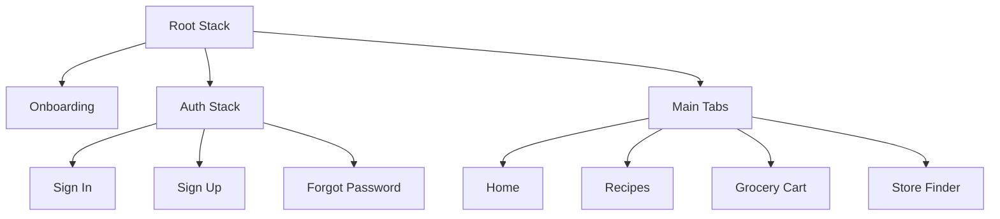
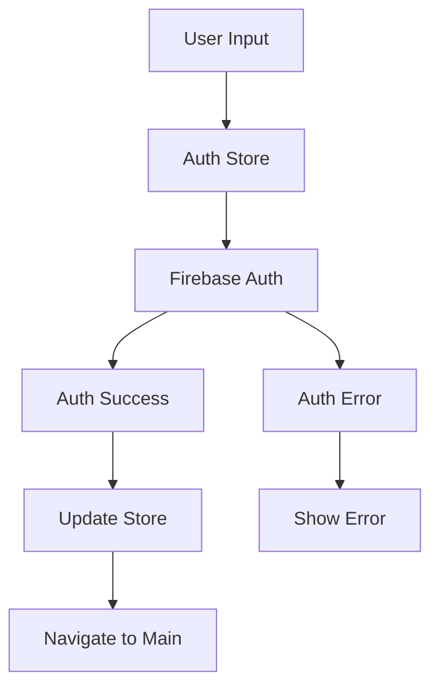
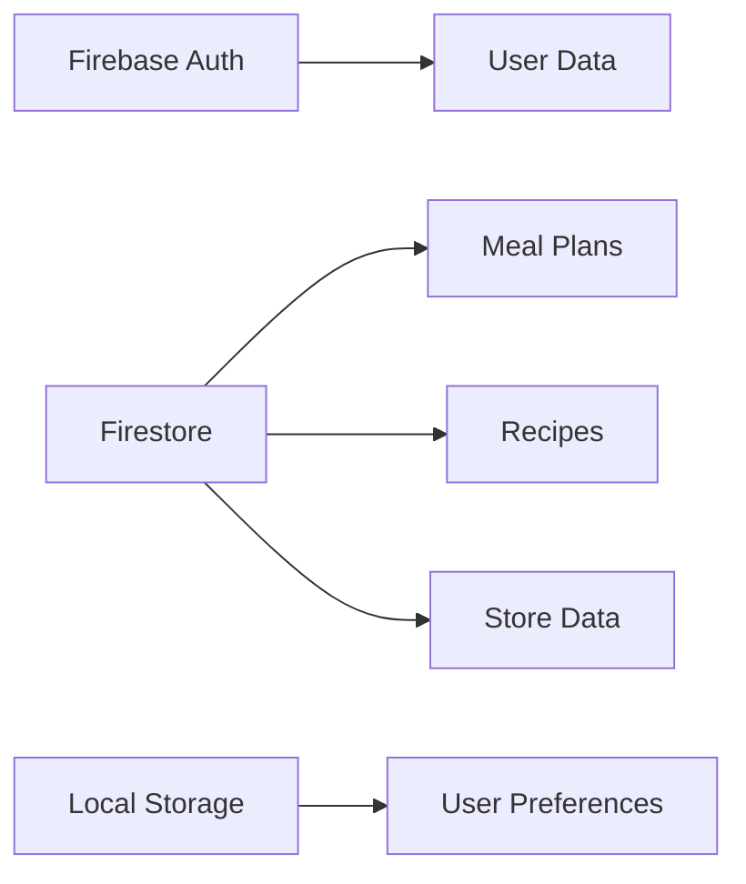

# FlavrMap System Patterns

## Architecture Overview
FlavrMap follows a modern React Native architecture with:
- Expo as the development platform
- TypeScript for type safety
- Firebase for backend services
- Zustand for state management
- React Navigation for routing

## Key Technical Decisions

### 1. Navigation Structure

### 2. State Management
- **Zustand Stores**
  - Auth Store: 
    - User authentication state
    - Loading states
    - Error handling
    - Sign in/up/out methods
  - Meal Store: Weekly meal plans
  - Recipe Store: Available recipes
  - Cart Store: Shopping cart state
  - Store Store: Store information and prices

### 3. Authentication Flow

### 4. Form Handling
- Keyboard submission support
- Field validation
- Error messages
- Loading states
- Navigation after success

### 5. Data Flow

### 6. Component Structure
- **Screens**: Top-level navigation components
  - Auth screens with consistent styling
  - Form handling patterns
  - Error boundary implementation
- **Components**: Reusable UI elements
- **Hooks**: Custom hooks for data fetching and state management
- **Utils**: Helper functions and constants

### 7. Firebase Integration
- Authentication: 
  - Email/Password authentication
  - Error handling and formatting
  - Auth state persistence
  - Protected routes
- Firestore: User data, meal plans, recipes, store data
- Storage: Recipe images, user avatars

### 8. API Design
- RESTful endpoints for external services
- GraphQL for complex data queries
- WebSocket for real-time updates

### 9. Error Handling
- Global error boundary
- Form-level error handling
- Firebase error formatting
- Toast notifications for user feedback
- Error logging to Firebase
- Offline support with local storage

### 10. Testing Strategy
- Unit tests for utilities and hooks
- Component tests for UI elements
- Integration tests for navigation flows
- E2E tests for critical user journeys 